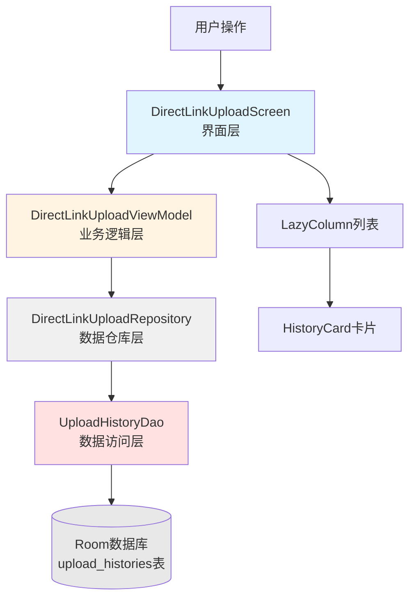

# 🎯 上传历史界面模块详解

## 快速理解

想象一下，上传历史界面就像一个**智能档案管理员**：

1. **DirectLinkUploadScreen** - 档案展示厅，负责把档案展示给你看
2. **DirectLinkUploadViewModel** - 档案管理员，负责管理档案的增删改查
3. **DirectLinkUploadRepository** - 档案仓库，负责从仓库取档案
4. **UploadHistoryDao** - 仓库管理员，负责具体的档案存取操作
5. **UploadHistory** - 档案卡片，记录每次上传的详细信息

## 架构图解



## 代码走读

### 第一步：数据实体类 - UploadHistory.kt

**文件位置**：[UploadHistory.kt](file:///g:/Project/legado_Plus/legado_Plus/app/src/main/java/io/legado/app/data/entities/UploadHistory.kt)

```kotlin
@Entity(
    tableName = "upload_histories",
    indices = [
        Index(value = ["uploadTime"]),    // 时间索引，快速排序
        Index(value = ["ruleId"]),        // 规则索引，快速筛选
        Index(value = ["success"])        // 状态索引，快速筛选
    ],
    foreignKeys = [
        ForeignKey(
            entity = DirectLinkUploadRule::class,
            parentColumns = ["id"],
            childColumns = ["ruleId"],
            onDelete = ForeignKey.CASCADE  // 规则删除时级联删除历史
        )
    ]
)
data class UploadHistory(
    @PrimaryKey(autoGenerate = true)
    val id: Long = 0,
    
    // 文件信息
    val fileName: String,               // 文件名
    val fileSize: Long,                 // 文件大小（字节）
    val contentType: String,            // MIME类型
    
    // 上传信息
    val uploadTime: Long = System.currentTimeMillis(),  // 上传时间
    val duration: Long,                 // 耗时（毫秒）
    val downloadUrl: String,            // 下载链接
    val expireTime: Long? = null,       // 过期时间
    
    // 规则信息
    val ruleId: Long,                   // 使用的规则ID
    val ruleSummary: String,            // 规则名称
    
    // 状态信息
    val success: Boolean,               // 是否成功
    val errorMsg: String? = null        // 错误信息
)
```

**关键点理解**：

- **索引优化**：为常用查询字段（uploadTime、ruleId、success）建立索引，提升查询速度
- **外键约束**：与规则表建立外键关系，规则删除时自动删除相关历史
- **完整记录**：既记录成功信息（下载链接），也记录失败信息（错误消息）

***

### 第二步：数据访问层 - UploadHistoryDao.kt

**文件位置**：[UploadHistoryDao.kt](file:///g:/Project/legado_Plus/legado_Plus/app/src/main/java/io/legado/app/data/dao/UploadHistoryDao.kt)

```kotlin
@Dao
interface UploadHistoryDao {
    
    // ① 获取所有历史记录（响应式）
    @Query("SELECT * FROM upload_histories ORDER BY uploadTime DESC")
    fun flowAll(): Flow<List<UploadHistory>>
    
    // ② 按规则ID筛选
    @Query("SELECT * FROM upload_histories WHERE ruleId = :ruleId ORDER BY uploadTime DESC")
    fun flowByRuleId(ruleId: Long): Flow<List<UploadHistory>>
    
    // ③ 搜索功能
    @Query("""
        SELECT * FROM upload_histories 
        WHERE fileName LIKE '%' || :keyword || '%' 
        OR downloadUrl LIKE '%' || :keyword || '%'
        OR ruleSummary LIKE '%' || :keyword || '%'
        ORDER BY uploadTime DESC
    """)
    fun flowSearch(keyword: String): Flow<List<UploadHistory>>
    
    // ④ 统计信息
    @Query("SELECT COUNT(*) FROM upload_histories WHERE success = 1")
    suspend fun getSuccessCount(): Int
    
    @Query("SELECT SUM(fileSize) FROM upload_histories WHERE success = 1")
    suspend fun getTotalUploadSize(): Long?
    
    // ⑤ 插入记录
    @Insert(onConflict = OnConflictStrategy.REPLACE)
    suspend fun insert(history: UploadHistory)
    
    // ⑥ 删除操作
    @Delete
    suspend fun delete(history: UploadHistory)
    
    @Query("DELETE FROM upload_histories")
    suspend fun deleteAll(): Int
    
    @Query("DELETE FROM upload_histories WHERE uploadTime < :timestamp")
    suspend fun deleteOldRecords(timestamp: Long): Int
}
```

**关键点理解**：

- **Flow响应式**：所有查询方法返回 `Flow<List<UploadHistory>>`，数据变化时自动通知UI更新
- **多维度查询**：支持按时间、规则、状态、关键词等多种方式查询
- **统计功能**：提供成功次数、总大小等统计数据
- **清理机制**：支持删除旧记录，避免数据库膨胀

***

### 第三步：数据仓库层 - DirectLinkUploadRepository.kt

**文件位置**：[DirectLinkUploadRepository.kt](file:///g:/Project/legado_Plus/legado_Plus/app/src/main/java/io/legado/app/model/upload/DirectLinkUploadRepository.kt)

```kotlin
class DirectLinkUploadRepository {
    
    private val ruleDao = appDb.directLinkUploadRuleDao
    private val historyDao = appDb.uploadHistoryDao
    
    // ① 获取历史记录（响应式）
    fun getHistories(): Flow<List<UploadHistory>> = historyDao.flowAll()
    
    // ② 按规则筛选
    fun getHistoriesByRule(ruleId: Long): Flow<List<UploadHistory>> = 
        historyDao.flowByRuleId(ruleId)
    
    // ③ 搜索历史
    fun searchHistories(keyword: String): Flow<List<UploadHistory>> = 
        historyDao.flowSearch(keyword)
    
    // ④ 添加历史记录
    suspend fun addHistory(history: UploadHistory) {
        historyDao.insert(history)
    }
    
    // ⑤ 删除历史记录
    suspend fun deleteHistory(history: UploadHistory) {
        historyDao.delete(history)
    }
    
    // ⑥ 清除所有历史
    suspend fun clearAllHistories(): Int = historyDao.deleteAll()
    
    // ⑦ 删除旧记录
    suspend fun deleteOldHistories(days: Int): Int {
        val timestamp = System.currentTimeMillis() - (days * 24 * 60 * 60 * 1000L)
        return historyDao.deleteOldRecords(timestamp)
    }
    
    // ⑧ 获取统计信息
    suspend fun getUploadStats(): UploadStats {
        val totalCount = historyDao.getCount()
        val successCount = historyDao.getSuccessCount()
        val totalSize = historyDao.getTotalUploadSize() ?: 0L
        return UploadStats(
            totalCount = totalCount,
            successCount = successCount,
            failedCount = totalCount - successCount,
            totalSize = totalSize
        )
    }
}
```

**关键点理解**：

- **Repository模式**：封装数据访问逻辑，隔离数据源和业务逻辑
- **统一接口**：为ViewModel提供简洁的数据操作方法
- **数据转换**：将DAO返回的原始数据转换为业务需要的格式（如UploadStats）

***

### 第四步：业务逻辑层 - DirectLinkUploadViewModel.kt

**文件位置**：[DirectLinkUploadViewModel.kt](file:///g:/Project/legado_Plus/legado_Plus/app/src/main/java/io/legado/app/ui/upload/DirectLinkUploadViewModel.kt)

```kotlin
class DirectLinkUploadViewModel(application: Application) : BaseViewModel(application) {
    
    private val repository = DirectLinkUploadRepository()
    
    // ① 响应式数据源
    val rules = repository.getRules()
    val histories = repository.getHistories()  // 关键：获取历史记录Flow
    
    private val _uiState = MutableStateFlow<UiState>(UiState.Idle)
    val uiState: StateFlow<UiState> = _uiState.asStateFlow()
    
    private val _uploadState = MutableStateFlow<UploadState>(UploadState.Idle)
    val uploadState: StateFlow<UploadState> = _uploadState.asStateFlow()
    
    // ② 删除单条历史
    fun deleteHistory(history: UploadHistory) {
        execute {
            repository.deleteHistory(history)
            loadStats()  // 重新加载统计信息
        }.onError {
            _uiState.value = UiState.Error("删除历史记录失败: ${it.localizedMessage}")
        }
    }
    
    // ③ 清除所有历史
    fun clearAllHistories() {
        execute {
            val count = repository.clearAllHistories()
            loadStats()
            _uiState.value = UiState.Success("已清除 $count 条历史记录")
        }.onError {
            _uiState.value = UiState.Error("清除历史记录失败: ${it.localizedMessage}")
        }
    }
    
    // ④ 删除旧历史
    fun deleteOldHistories(days: Int) {
        execute {
            val count = repository.deleteOldHistories(days)
            loadStats()
            _uiState.value = UiState.Success("已清除 $count 条历史记录")
        }.onError {
            _uiState.value = UiState.Error("清除历史记录失败: ${it.localizedMessage}")
        }
    }
    
    // ⑤ 上传文件并记录历史
    fun uploadFile(
        fileName: String,
        file: Any,
        contentType: String,
        rule: DirectLinkUploadRule? = null
    ) {
        execute {
            _uploadState.value = UploadState.Uploading(0)
            
            val uploadRule = rule ?: repository.getDefaultRule()
                ?: throw IllegalStateException("没有可用的上传规则")
            
            val startTime = System.currentTimeMillis()
            
            try {
                // 执行上传
                val downloadUrl = DirectLinkUpload.upLoad(
                    fileName = fileName,
                    file = file,
                    contentType = contentType,
                    rule = DirectLinkUpload.Rule(
                        uploadUrl = uploadRule.uploadUrl,
                        downloadUrlRule = uploadRule.downloadUrlRule,
                        summary = uploadRule.summary,
                        compress = uploadRule.compress
                    )
                )
                
                val duration = System.currentTimeMillis() - startTime
                
                // 创建成功历史记录
                val history = UploadHistory(
                    fileName = fileName,
                    fileSize = getFileSize(file),
                    contentType = contentType,
                    duration = duration,
                    downloadUrl = downloadUrl,
                    ruleId = uploadRule.id,
                    ruleSummary = uploadRule.summary,
                    success = true
                )
                
                repository.addHistory(history)  // 保存历史
                repository.incrementUploadCount(uploadRule.id)  // 增加规则使用次数
                
                _uploadState.value = UploadState.Success(downloadUrl)
                loadStats()
            } catch (e: Exception) {
                val duration = System.currentTimeMillis() - startTime
                
                // 创建失败历史记录
                val history = UploadHistory(
                    fileName = fileName,
                    fileSize = getFileSize(file),
                    contentType = contentType,
                    duration = duration,
                    downloadUrl = "",
                    ruleId = uploadRule.id,
                    ruleSummary = uploadRule.summary,
                    success = false,
                    errorMsg = e.localizedMessage
                )
                
                repository.addHistory(history)  // 即使失败也记录历史
                
                _uploadState.value = UploadState.Error(e.localizedMessage ?: "上传失败")
            }
        }.onError {
            _uploadState.value = UploadState.Error(it.localizedMessage ?: "上传失败")
        }
    }
}
```

**关键点理解**：

- **Flow响应式**：`histories` 是一个 Flow，数据库变化时自动通知UI
- **成功失败都记录**：无论上传成功还是失败，都会创建历史记录
- **统计同步**：删除或添加历史后，自动重新加载统计数据
- **错误处理**：所有操作都有错误处理，失败时更新UI状态

***

### 第五步：界面显示层 - DirectLinkUploadScreen.kt

**文件位置**：[DirectLinkUploadScreen.kt](file:///g:/Project/legado_Plus/legado_Plus/app/src/main/java/io/legado/app/ui/upload/DirectLinkUploadScreen.kt)

#### 5.1 主界面结构

```kotlin
@Composable
fun DirectLinkUploadScreen(
    viewModel: DirectLinkUploadViewModel = viewModel(),
    onBackClick: () -> Unit
) {
    // ① 获取响应式数据
    val rules by viewModel.rules.collectAsState(initial = emptyList())
    val histories by viewModel.histories.collectAsState(initial = emptyList())  // 关键
    val uiState by viewModel.uiState.collectAsState()
    val uploadState by viewModel.uploadState.collectAsState()
    
    // ② 状态管理
    var selectedTab by remember { mutableStateOf(0) }  // 0=规则管理, 1=上传历史
    var showClearDialog by remember { mutableStateOf(false) }
    
    val tabs = listOf("规则管理", "上传历史")
    
    Scaffold(
        topBar = {
            TopAppBar(
                title = { Text("直链上传配置") },
                navigationIcon = {
                    IconButton(onClick = onBackClick) {
                        Icon(Icons.AutoMirrored.Filled.ArrowBack, "返回")
                    }
                },
                actions = {
                    // 更多菜单：粘贴规则、导入默认规则、清除历史
                    IconButton(onClick = { showMenu = true }) {
                        Icon(Icons.Default.MoreVert, "更多")
                    }
                    DropdownMenu(...) {
                        DropdownMenuItem(text = { Text("清除历史") }, onClick = { 
                            showClearDialog = true 
                        })
                    }
                }
            )
        }
    ) { paddingValues ->
        Column(modifier = Modifier.padding(paddingValues)) {
            // ③ Tab切换
            TabRow(selectedTabIndex = selectedTab) {
                tabs.forEachIndexed { index, title ->
                    Tab(
                        selected = selectedTab == index,
                        onClick = { selectedTab = index },
                        text = { Text(title) }
                    )
                }
            }
            
            // ④ 根据Tab显示不同内容
            when (selectedTab) {
                0 -> RuleListTab(rules = rules, ...)
                1 -> HistoryListTab(histories = histories, ...)  // 显示上传历史
            }
        }
        
        // ⑤ 清除历史确认对话框
        if (showClearDialog) {
            AlertDialog(
                title = { Text("清除历史") },
                text = { Text("确定要清除所有上传历史记录吗？") },
                confirmButton = {
                    TextButton(onClick = {
                        viewModel.clearAllHistories()  // 调用ViewModel清除
                        showClearDialog = false
                    }) {
                        Text("确定", color = MaterialTheme.colorScheme.error)
                    }
                }
            )
        }
    }
}
```

**关键点理解**：

- **collectAsState**：将 Flow 转换为 Compose 的 State，数据变化时自动重组UI
- **Tab切换**：使用 `selectedTab` 控制显示规则管理还是上传历史
- **响应式更新**：`histories` 变化时，`HistoryListTab` 自动更新

***

#### 5.2 历史列表显示

```kotlin
@Composable
fun HistoryListTab(
    histories: List<UploadHistory>,
    onDelete: (UploadHistory) -> Unit,
    onCopy: (UploadHistory) -> Unit
) {
    // ① 空状态处理
    if (histories.isEmpty()) {
        Box(
            modifier = Modifier.fillMaxSize(),
            contentAlignment = Alignment.Center
        ) {
            Column(horizontalAlignment = Alignment.CenterHorizontally) {
                Icon(Icons.Default.History, modifier = Modifier.size(64.dp))
                Text("暂无上传历史")
            }
        }
    } else {
        // ② 列表显示
        LazyColumn(
            modifier = Modifier.fillMaxSize(),
            contentPadding = PaddingValues(vertical = 8.dp)
        ) {
            items(histories) { history ->
                HistoryCard(
                    history = history,
                    onDelete = { onDelete(history) },
                    onCopy = { onCopy(history) }
                )
            }
        }
    }
}
```

**关键点理解**：

- **空状态**：没有历史时显示提示信息
- **LazyColumn**：使用懒加载列表，只渲染可见项，性能优化
- **items**：遍历 `histories` 列表，为每条记录创建一个卡片

***

#### 5.3 历史卡片详情

```kotlin
@Composable
fun HistoryCard(
    history: UploadHistory,
    onDelete: () -> Unit,
    onCopy: () -> Unit
) {
    Card(
        modifier = Modifier
            .fillMaxWidth()
            .padding(horizontal = 12.dp, vertical = 4.dp)
    ) {
        Column(modifier = Modifier.padding(16.dp)) {
            // ① 文件名和状态
            Row(
                modifier = Modifier.fillMaxWidth(),
                horizontalArrangement = Arrangement.SpaceBetween
            ) {
                Row(verticalAlignment = Alignment.CenterVertically) {
                    // 成功/失败图标
                    Icon(
                        imageVector = if (history.success) Icons.Default.CheckCircle 
                                      else Icons.Default.Error,
                        tint = if (history.success) MaterialTheme.colorScheme.primary
                               else MaterialTheme.colorScheme.error
                    )
                    Text(history.fileName, fontWeight = FontWeight.Medium)
                }
                
                // 失败标签
                if (!history.success) {
                    Surface(color = MaterialTheme.colorScheme.errorContainer) {
                        Text("失败", color = MaterialTheme.colorScheme.error)
                    }
                }
            }
            
            // ② 文件信息
            Row(horizontalArrangement = Arrangement.spacedBy(16.dp)) {
                Text(formatFileSize(history.fileSize))  // 文件大小
                if (history.success) {
                    Text("耗时 ${history.duration}ms")  // 上传耗时
                }
            }
            
            // ③ 上传时间
            Row(verticalAlignment = Alignment.CenterVertically) {
                Icon(Icons.Default.Schedule, modifier = Modifier.size(14.dp))
                Text(formatDateTime(history.uploadTime))  // 格式化时间
            }
            
            // ④ 下载链接（成功时显示）
            if (history.success && history.downloadUrl.isNotBlank()) {
                Surface(color = MaterialTheme.colorScheme.surfaceVariant) {
                    Row {
                        Icon(Icons.Default.Link)
                        Text(history.downloadUrl, maxLines = 2)
                    }
                }
            }
            
            // ⑤ 错误信息（失败时显示）
            if (!history.success && !history.errorMsg.isNullOrBlank()) {
                Surface(color = MaterialTheme.colorScheme.errorContainer) {
                    Row {
                        Icon(Icons.Default.Warning, tint = MaterialTheme.colorScheme.error)
                        Text(history.errorMsg, color = MaterialTheme.colorScheme.error)
                    }
                }
            }
            
            // ⑥ 操作按钮
            Row(
                modifier = Modifier.fillMaxWidth(),
                horizontalArrangement = Arrangement.End
            ) {
                if (history.success && history.downloadUrl.isNotBlank()) {
                    TextButton(onClick = onCopy) {
                        Icon(Icons.Default.ContentCopy)
                        Text("复制链接")
                    }
                }
                TextButton(onClick = onDelete) {
                    Icon(Icons.Default.Delete, tint = MaterialTheme.colorScheme.error)
                    Text("删除", color = MaterialTheme.colorScheme.error)
                }
            }
        }
    }
}
```

**关键点理解**：

- **状态区分**：成功显示绿色勾号和下载链接，失败显示红色叉号和错误信息
- **信息完整**：显示文件名、大小、耗时、时间、下载链接/错误信息
- **操作便捷**：提供"复制链接"和"删除"按钮

***

## 数据流分析

```
用户操作（上传文件）
   │
   ▼
DirectLinkUploadViewModel.uploadFile()
   │
   ├─ 上传成功 ──┐
   │            │
   ├─ 上传失败 ──┤
   │            │
   ▼            ▼
创建 UploadHistory 对象
   │
   ▼
DirectLinkUploadRepository.addHistory()
   │
   ▼
UploadHistoryDao.insert()
   │
   ▼
Room 数据库插入记录
   │
   ▼
数据库变化触发 Flow 更新
   │
   ▼
UploadHistoryDao.flowAll() 发出新数据
   │
   ▼
DirectLinkUploadRepository.getHistories() 传递
   │
   ▼
DirectLinkUploadViewModel.histories 更新
   │
   ▼
DirectLinkUploadScreen.collectAsState() 接收
   │
   ▼
LazyColumn 重组
   │
   ▼
HistoryCard 显示新记录
```

**关键流程**：

1. **上传完成** → 创建历史记录
2. **插入数据库** → 触发 Flow 发出数据
3. **Flow传递** → Repository → ViewModel → Screen
4. **UI更新** → LazyColumn 自动显示新记录

***

## 实践任务

### 任务1：基础任务 - 添加搜索功能

**要求**：

- 在历史列表上方添加搜索框
- 输入关键词时实时过滤历史记录
- 支持按文件名、下载链接、规则名称搜索

**预期效果**：

```
┌─────────────────────────┐
│ 🔍 搜索历史记录...      │
└─────────────────────────┘
┌─────────────────────────┐
│ test.json               │
│ 1.2 MB · 耗时 1234ms    │
│ 2024-01-01 12:00       │
│ https://example.com/... │
└─────────────────────────┘
```

**提示**：

- 使用 `TextField` 组件
- 调用 `repository.searchHistories(keyword)`
- 使用 `debounce` 防抖

***

### 任务2：进阶任务 - 添加筛选功能

**要求**：

- 添加筛选按钮，支持按成功/失败状态筛选
- 添加时间范围筛选（今天、最近7天、最近30天、全部）
- 添加按规则筛选

**预期效果**：

```
┌─────────────────────────┐
│ 筛选: [全部] [成功] [失败] │
│ 时间: [全部] [今天] [7天] │
│ 规则: [全部] [喵公子①]   │
└─────────────────────────┘
```

**提示**：

- 使用 `FilterChip` 组件
- 调用 `historyDao.flowBySuccess()` 和 `flowByTimeRange()`
- 使用 `combine` 组合多个 Flow

***

### 任务3：挑战任务 - 添加批量操作

**要求**：

- 长按历史卡片进入多选模式
- 支持批量删除、批量复制链接
- 显示选中数量和全选/取消全选按钮

**预期效果**：

```
┌─────────────────────────┐
│ 已选中 3 条记录         │
│ [全选] [取消] [删除] [复制] │
└─────────────────────────┘
☑ test1.json
☑ test2.json
☐ test3.json
```

**提示**：

- 使用 `selectionMode` 状态
- 使用 `Checkbox` 组件
- 批量操作使用事务

***

## 进阶挑战

### 1. 性能优化

- **分页加载**：使用 Room 的 `Paging 3` 库实现分页，避免一次性加载大量历史
- **缓存优化**：对频繁访问的历史记录进行内存缓存
- **懒加载图片**：如果历史记录包含预览图，使用 Coil 库异步加载

### 2. 功能扩展

- **导出历史**：支持将历史记录导出为 CSV/JSON 文件
- **分享功能**：支持分享下载链接到其他应用
- **二维码生成**：为下载链接生成二维码，方便扫码下载

### 3. 架构改进

- **UseCase 层**：引入 Domain 层，使用 UseCase 封装业务逻辑
- **依赖注入**：使用 Hilt 进行依赖注入，降低耦合度
- **单元测试**：为 Repository 和 ViewModel 编写单元测试

***

## 常见问题

**Q1: 为什么使用 Flow 而不是 LiveData？**
A: Flow 是 Kotlin 协程的一部分，具有更好的协程支持、操作符丰富、线程切换方便等优点。LiveData 主要用于生命周期感知，而 Flow 配合 `collectAsState()` 可以实现相同效果。

**Q2: collectAsState 和 collect 的区别？**
A: `collectAsState()` 是 Compose 的扩展函数，将 Flow 转换为 Compose 的 State，数据变化时自动触发重组。`collect()` 是协程的挂起函数，需要在协程作用域中调用，适合在 ViewModel 中使用。

**Q3: 如何避免数据库查询阻塞主线程？**
A: Room 的所有查询方法默认在后台线程执行。对于返回 Flow 的查询，Room 会自动处理线程切换。对于返回具体值的查询（如 `getCount()`），需要标记为 `suspend` 函数，在协程中调用。

**Q4: 为什么上传失败也要记录历史？**
A: 记录失败历史可以帮助用户：

- 了解哪些文件上传失败
- 查看失败原因
- 方便重新上传
- 统计上传成功率

**Q5: 如何实现历史记录的自动清理？**
A: 可以使用 WorkManager 定期执行清理任务：

```kotlin
class CleanHistoryWorker : Worker() {
    override fun doWork(): Result {
        val days = AppConfig.autoCleanHistoryDays
        repository.deleteOldHistories(days)
        return Result.success()
    }
}
```

***

## 学习资源

### 官方文档

- [Room 数据库指南](https://developer.android.com/training/data-storage/room)
- [Kotlin Flow 官方文档](https://kotlinlang.org/docs/flow.html)
- [Jetpack Compose 官方教程](https://developer.android.com/jetpack/compose)

### 相关技术文章

- [Room 数据库最佳实践](https://developer.android.com/topic/libraries/architecture/room)
- [Flow 与 LiveData 的选择](https://developer.android.com/kotlin/flow/stateflow-and-sharedflow)
- [Compose 状态管理](https://developer.android.com/jetpack/compose/state)

### 推荐书籍

- 《Android 开发艺术探索》- 第9章 数据存储
- 《Kotlin 实战》- 第11章 协程
- 《Jetpack Compose 从入门到实战》

***

希望这个详细的讲解能帮助你深入理解上传历史界面的实现逻辑！如果有任何疑问，欢迎继续提问。
